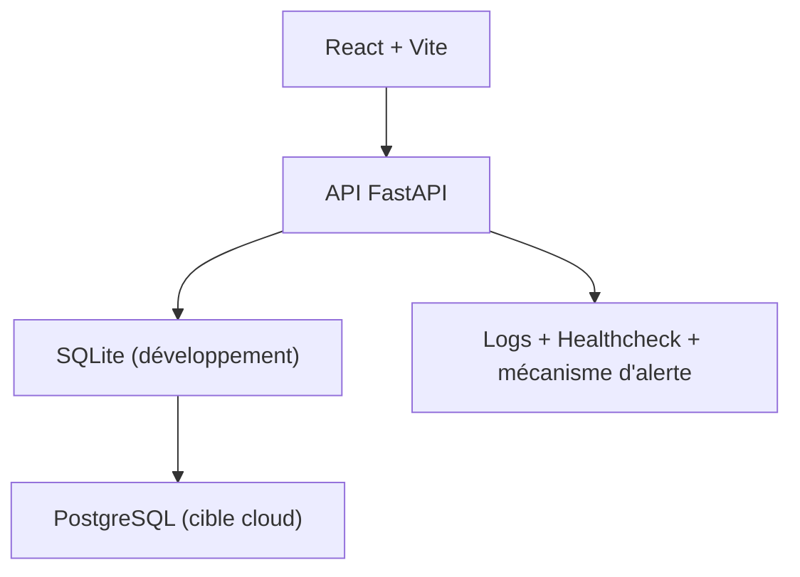

# M-Motors - Location / achat de véhicules

## Contexte

M-Motors est une entreprise spécialisée dans la vente de véhicules d’occasion.

Le site ajoute un service de location longue durée avec option d’achat tout en conservant le parcours d’achat existant.

L’application permet aux clients :

de rechercher un véhicule ;
de créer un compte ;
déposer un dossier dématérialisé avec documents ;
suivre son avancement depuis leur espace client.

Le back-office permet aux administrateurs :

d’ajouter des véhicules ;
  de basculer un véhicule entre vente et location ;
  de valider ou refuser les dossiers.

### Backend

```bash
cd mmotors/backend
python -m venv .venv
.\.venv\Scripts\Activate.ps1
pip install -r requirements.txt
uvicorn app.main:app --reload
```

### Frontend

```bash
cd mmotors/frontend
npm install
npm run dev
```

---

## URLs locales

Frontend : `http://localhost:5173`
Backend : `http://localhost:8000`
Documentation API : `http://localhost:8000/docs`
Santé API : `http://localhost:8000/health`

---

## Architecture



Cette architecture privilégie la simplicité, la maintenabilité et une évolution progressive vers un déploiement cloud.

---

## Organisation du développement

Le développement a été organisé en plusieurs étapes :

- préparation du dépôt et documentation ;
- validation backend et API ;
- validation des parcours métier ;
- intégration frontend / backend ;
- recette fonctionnelle finale.

Les validations ont été enregistrées progressivement dans l’historique Git.

---

## Tests

### Backend

```bash
cd mmotors/backend
pytest --cov=app
```

### Frontend

```bash
cd mmotors/frontend
npm test
```

Résultats observés :

- 19 tests backend exécutés ;
- couverture backend : **92 %**.

Les tests couvrent :

authentification 
inscription 
erreurs de connexion 
recherche véhicule
filtres achat/location
dépôt de dossier 
suivi de dossier 
droits administrateur
validation des dossiers 
endpoint de santé

---

## Sécurité

Mesures mises en place :

authentification JWT Bearer
hash des mots de passe avec bcrypt
rôles `user` et `admin
validation des entrées avec Pydantic
contrôle d’accès sur les routes administrateur
formats de documents limités
variables d’environnement pour les secrets
journalisation applicative
endpoint de supervision

---

## Monitoring

Surveillance applicative :

GET /health` vérifie l’état de l’API
`POST /health/alert-test` permet de tester le mécanisme d’aleret
journalisation des requêtes :
  méthode
  chemin
  statut
durée


## Déploiement

Le projet est conçu pour être déployé sur une plateforme cloud compatible.

Variables principales :

- `DATABASE_URL`
- `JWT_SECRET_KEY`
- `CORS_ORIGINS`
- `VITE_API_URL`

Voir :

```text
docs/deploiement.md
```

---

## Fonctionnalités

### Client

recherche de véhicules
filtre achat/location
création de compte
dépôt de dossier
téléversement de documents
suivi du statut

### Administrateur

ajout de véhicules 
ajout location 
ajout vente 
bascule vente/location 
consultation des dossiers 
validation 
refus avec commentaire

---

## Captures

Captures à intégrer au dossier final :

recherche véhicules 
dépôt dossier 
suivi client 
administration véhicules 
administration dossiers
endpoint `/health

Dossier :

```text
docs/captures/
```
