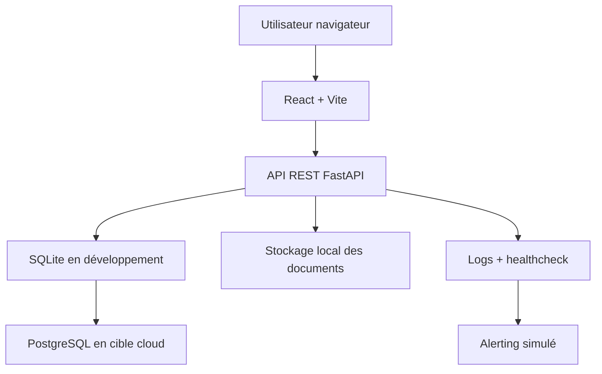

# Architecture technique

## Vue d'ensemble

## Choix techniques

- React + Vite : interface rapide à développer, adaptée à un projet d'examen.
- FastAPI : API claire, documentation Swagger automatique, validation des entrées.
- SQLite : base simple pour le développement local et la correction.
- PostgreSQL : cible recommandée pour le cloud.
- Pytest et React Testing Library : tests centrés sur les comportements critiques.

## Organisation applicative

Le backend est découpé en routes, services, modèles, schémas et sécurité. Les routes gèrent HTTP, les services portent la logique métier, les schémas valident les entrées et les modèles décrivent la base.

Le frontend est découpé en pages, composants et service API. Les pages représentent les parcours métier, les composants sont réutilisables, et `services/api.js` centralise les appels HTTP.

## Flux principal

1. Le client recherche un véhicule.
2. Il crée un compte ou se connecte.
3. Il dépose un dossier achat ou location avec documents.
4. L'administrateur consulte le dossier.
5. L'administrateur valide ou refuse la demande.
6. Le client suit le statut depuis son espace.

## RPO et RTO

- RPO : 15 min.
- RTO : 1 heure.

Ces valeurs impliquent des sauvegardes fréquentes de la base et une procédure de restauration documentée. Pour un déploiement cloud, PostgreSQL managé est recommandé afin de bénéficier de sauvegardes automatiques.

## Limites assumées

- Pas de paiement.
- Pas de microservices.
- Pas de workflow documentaire complexe.
- Pas de stockage cloud réel des fichiers dans ce premier rendu.

